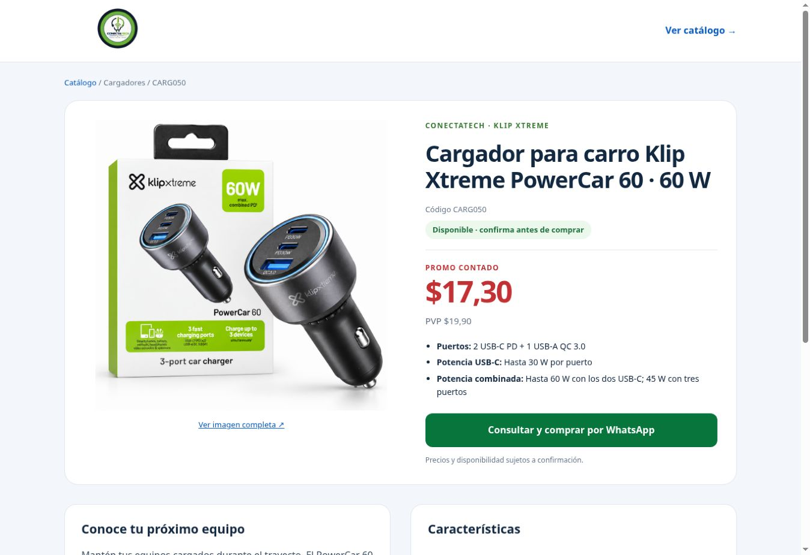

# Publicación y preparación de importación masiva — 9 de octubre de 2026

**Resultado: 3 productos completados y publicados; 1.162 pendientes de enriquecimiento; 0 errores pendientes en el lote.**

Repositorio: `conectatech-ec/conectatech-ec.github.io`. Commit de implementación: `f9c6e7405c9f171e4b3eba7e8ae392c0531dc266`. Despliegue Pages confirmado exitoso sobre `8440d4744c73b1a3b9b30ae60909e67e2c0a8e09`, que incluye las exportaciones y auditoría automáticas posteriores.

## Publicados y verificados

| Solicitado | SKU de 593 | Promo contado | PVP | Stock conservado | Imagen original | URL |
|---|---|---:|---:|---:|---|---|
| CARG050 | CARG050 | $17,30 | $19,90 | 7 | 1254 × 1254 | [Klip Xtreme PowerCar 60](https://conectatech-ec.github.io/productos/carg050-cargador-para-vehiculo-60w-klipxtreme-powercar-060/) |
| MICR027 | MICR27 | $102,01 | $117,31 | 1 | 1200 × 1600 | [JBL Quantum Stream](https://conectatech-ec.github.io/productos/micr27-microfono-jbl-quantum-stream/) |
| CARG016 | CARG016 | $14,00 | $16,10 | 6 | 1200 × 1600 | [BATEN CX-305](https://conectatech-ec.github.io/productos/carg016-cargador-baten-25w-cx-305/) |

Los valores son los del catálogo y de la **exportación de Sistema 593 del 08-10-2026**; no se consultó stock en tiempo real. Se verificaron los 1.165 SKU: **ningún precio, PVP o stock fue modificado**. La base pública 593 permanece intacta. Tampoco cambió el contenido editorial de los otros 1.162 productos.

Verificación HTTP registrada el 09-10-2026 a las 12:10:07 de Ecuador: tres páginas y tres imágenes con HTTP 200, SKU, nombre, precio, moneda, disponibilidad, PVP visible, URL canónica y SHA-256 de imagen correctos. Las tres fichas se revisaron visualmente en el navegador. Se comprobó una sola tarjeta por búsqueda CARG050, CARG016, MICR27 y MICR027. El alias no crea otro producto ni cambia el código del sistema.

## Qué se completó

- Imágenes originales conservadas byte por byte; sin regenerar, ampliar miniaturas ni modificar el logo. CARG050 usa el archivo proporcionado de fondo blanco con cargador y caja, `CARG050_foto_principal_IA.png`; no se presenta como nueva fotografía tomada en tienda.
- CARG016 y MICR27 usan sus fotos frontales originales de caja. Las imágenes reemplazan las portadas SVG de los cargadores y añaden la imagen que faltaba al micrófono.
- Fichas comerciales con nombre legible, descripción, características verificadas, precio contado destacado, PVP sin tachado, enlace a imagen completa, contacto WhatsApp, dirección y entrega contraentrega en Quito.
- CARG050: se aclara la potencia máxima de 60 W con dos USB-C y 45 W con tres puertos, según [ficha oficial Klip Xtreme](https://klip-xtreme-frontend.s3.amazonaws.com/media/docs/KCC-060_DS_SPA.pdf).
- JBL: modelo identificado por su caja y datos contrastados con la [ficha oficial Quantum Stream](https://www.jbl.com/on/demandware.static/-/Sites-masterCatalog_Harman/default/dwbbf3fa6c/pdfs/JBL_Quantum_Stream_SpecSheet_English.pdf).
- BATEN: solo se incorporaron modelo CX-305, PD, 25 W, USB-C y cable USB-C a USB-C de 1 m visibles en la caja. No se añadieron protocolos específicos, compatibilidad universal, tiempos de carga ni certificaciones no comprobadas.
- Las exportaciones multicanal convierten las rutas de imagen en URLs completas: ahora incluyen 9 productos con imagen, frente a los 6 enlaces externos que reconocía el exportador anterior. No se subió contenido a Meta.

## Pendientes

El catálogo tiene 1.165 fichas; 1.162 cuentan con stock positivo en el corte existente. La finalización editorial de este trabajo corresponde exclusivamente a los tres SKU solicitados.

- **1.156 productos sin imagen:** recuperar originales identificados por SKU y comprobar modelo/variante.
- **6 productos con imágenes externas anteriores:** revisar imagen/variante y completar su ficha antes de considerarlos terminados.
- Total pendiente de enriquecimiento: **1.162**. El detalle individual está en `pendientes-enriquecimiento.csv` y `importacion-productos.json`.
- Para actualizar valores o existencias se requiere una nueva exportación validada de 593. No se ha inventado ni estimado inventario.

## Automatización preparada

`scripts/importar-productos.py`, `importacion/plantilla-1165-productos.csv` y el workflow **Importar fichas e imágenes por SKU** quedan publicados. Ver instrucciones en [`importacion/GUIA.md`](../importacion/GUIA.md).

La herramienta asocia fotos por SKU exacto, admite alias explícitos, comprueba resolución e integridad, genera nombres por hash, conserva precios/stock y produce reporte de aplicados, sin cambios, pendientes y errores. Un error bloquea todo el lote. El modo predeterminado simula; aplicar genera fichas, exportaciones, un commit y una solicitud de reconstrucción de Pages. El verificador separado confirma la publicación real.

**Validación realizada:** siete pruebas satisfactorias: conservación de todos los valores e idempotencia, colisión entre SKU y alias, SKU desconocido, columnas financieras prohibidas, ruta de imagen fuera de carpeta, miniatura pequeña y procesamiento de las 1.165 filas. El lote real fue aplicado mediante este importador y publicado mediante la conexión GitHub. El nuevo workflow está preparado; todavía no se ha ejecutado en GitHub Actions ni se ha realizado una carga editorial de 1.100 productos.

La revisión visual sigue siendo necesaria: el script no reconoce la identidad del producto, la variante ni IMEI/series en una foto. Las características solo se importan cuando tienen fuente y se marcan como verificadas.

## Errores y evidencia

No hay errores pendientes de publicación o validación en los tres SKU. La comprobación inicial durante el despliegue detectó las páginas antiguas; tras finalizar Pages, la verificación final pasó en las tres. La instalación de un navegador local no estuvo disponible; la revisión visual se realizó con el navegador remoto.

- `verificacion-publicacion.json`: resultado HTTP y hashes de originales.
- `sincronizacion-593.json`: cero modificaciones respecto a 593.
- `importacion-productos.json`: detalle de lote y pendientes.
- `vista-carg050.jpg`: captura de la ficha publicada.

